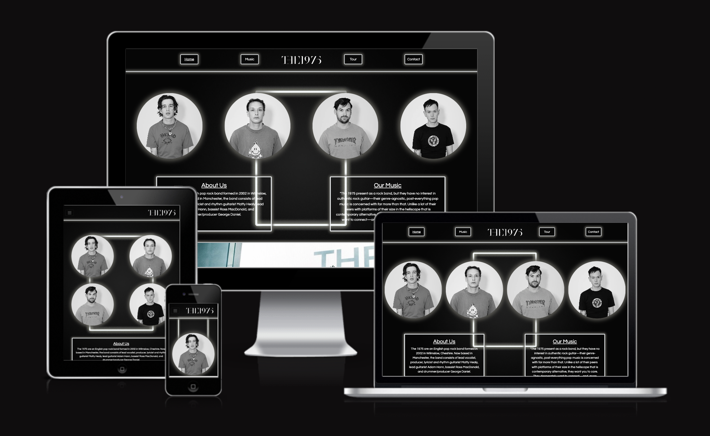

# Milestone Project 1

 

[Link to Live Website](https://tommahawk65.github.io/MS1-resub-/) 

## UX

### Project Goals

#### External user’s goal:
The site's users are fans and potential fans who wish to learn more about the band's history and the band members, listen to their music and possibly book them for shows.

#### Site owner's goal:
The band are interested in increasing their fanbase and selling more tickets to gigs.

 
### Design choices

I chose a modern minimalistic style to reflect the music of the band and to appeal to a younger audience.

### Wireframes Full View

#### Home Page

#### Music Page

#### Tour Dates Page

#### Contact Page

### Wireframes Mobile View

#### Home Page

#### Music Page

#### Tour Dates Page

#### Contact Page

## Features 

### Technologies

#### Programming languages 
 
- [HTML5](https://developer.mozilla.org/en-US/docs/Web/HTML) - the project used HTML to define structure and layout of the web page. 
- [CSS3](https://developer.mozilla.org/en-US/docs/Web/CSS) - the project used CSS style sheets to specify style of the web document elements; 
 
#### Frameworks & Extensions 
 
- [Bootstrap](https://getbootstrap.com/) – Bootstrap is a web framework that focuses on simplifying the development of informative web pages. 

- [Font Awesome](https://fontawesome.com/v4.7.0/) - Font Awesome icons were used for the footer social links for the website. 

#### **Tools**

- [GitHub](https://github.com/) - GitHub is a global company that provides hosting for software development version control using Git. 

- [Gitpod](https://gitpod.io/workspaces/) - One-click ready-to-code development environments for GitHub. 

- [Google fonts](https://fonts.google.com/) - Used to compare and choose fonts. 

- [Figma](https://www.figma.com/) - Figma is used to create the mockup designs for the project.

- [Chrome DevTools](https://developers.google.com/web/tools/chrome-devtools/open) - Used to detect problems and test responsiveness.

- [W3C Markup Validation Service](https://validator.w3.org/) - The W3C Markup Validation Service is used to check whether there were any errors in the HTML5 code. 

- [W3C CSS validator](https://jigsaw.w3.org/css-validator/) - The W3C CSS validator is used to check whether there were any errors in the CSS3 code.

### Existing Features

- __Navigation Bar__

  - Featured on all four pages, the full responsive navigation bar includes links to the Home page, Music, Tour Dates and Contact page and is identical in each page to allow for easy navigation.

  - This section will allow the user to easily navigate from page to page across all devices without having to revert back to the previous page via the ‘back’ button. 

- __The Footer__ 

  - The footer section includes links to the relevant social media sites for the band. The links will open to a new tab to allow easy navigation for the user. 

  - The footer is valuable to the user as it encourages them to keep connected via social media.

- __Home Page__

  - The home page greets new visitors with a collection of band member photos to identify the members.

  - There is also some basic info to give visitors some simple background information.

  
- __Music__

  - The music page will provide the user with supporting video/audio to see what the bands looks and sounds like. 

  - This section is valuable to the user as they will be able see and hear the bands music videos and full back catalogue.

- __The Tour Dates Page__

  - This page will allow users to see all the tour dates of the band and plan for when they come to their local area.

- __The Contact Page__

  - This page allows users to send a question to band, it also allows the band to receive emails from potential customers for marketing.

## Testing 

I have tested all elements of this website to ensure all the features work correctly.

I have spend a lot of time making sure this website is fully responsive on a number of devices.

### Validator Testing 

- HTML
  - No errors were returned when passing through the official [W3C validator]
- CSS
  - No errors were found when passing through the official [(Jigsaw) validator]

## Deployment

The project was developed using [GitPod](https://gitpod.io/) and pushed to [GitHub](https://github.com/):

To deploy the page to **GitHub Pages** these steps were taken:
1. Log in to **GitHub**.
2. Select https://github.com/Tommahawk65.
3. Click Settings and scroll down to **Pages**.
4. Under **Source** select **None** and then **Master Branch**.
5. The site automatically refreshes and the website deployed providing the link: https://tommahawk65.github.io/MS1-resub-/index.html

### How to contribute to the site

1. Navigate to [GitHub](https://github.com/) and log in
2. Locate my [Repository](https://github.com/Tommahawk65/MS1-resub-)
3. On the right side of the screen click Fork
4. This creates a copy in your own repository to make changes in [GitPod](https://gitpod.io/)
5. Once finished with changes add, commit and push to your own [GitHub](https://github.com/)
6. Click Pull Requests and select "New Pull Request" button.

### How to run the project locally

To clone this project from GitHub follow the instructions taken from [GitHub Docs](https://docs.github.com/en/github/creating-cloning-and-archiving-repositories/cloning-a-repository):
1. Navigate to my [GitHub Repository](https://github.com/Tommahawk65/MS1-resub-)
2. Above the files click the green Download Code link.
3. To clone using HTTPS click the clipboard symbol under "Clone with HTTPS". To clone using SSH key click Use SSH then click the clipboard symbol. To clone using GitHub CLI select Use GitHub CLI and click the clipboard symbol. 
4. Open Git Bash
5. Change the working directory to the location you want the cloned directory to be.
6. Type 'git clone' and paste the url copied from step 3. 
7. Press 'enter' to create your clone.

## Credits 

- The text for the Home page was taken from Wikipedia https://en.wikipedia.org/wiki/The_1975
- The icons in the footer were taken from [Font Awesome](https://fontawesome.com/)
- The box shadow effect on the images and buttons was created by Tiffany Rayside (https://codepen.io/tmrDevelops/pen/VeRvKX)

### Media

- The header hero image was taken from (https://i.redd.it/ujaqgg3dya021.jpg)
- The images of the band on  the home page were taken from (https://www.thefader.com/2019/09/12/the-1975-notes-on-a-conditional-form-interview)
- I used Spotify and YouTube to embed the media content (https://vimeo.com/77177308)(https://open.spotify.com/playlist/2XJHmI31uAsaSQTjPqcAPk?si=4860823d6a104d68)
