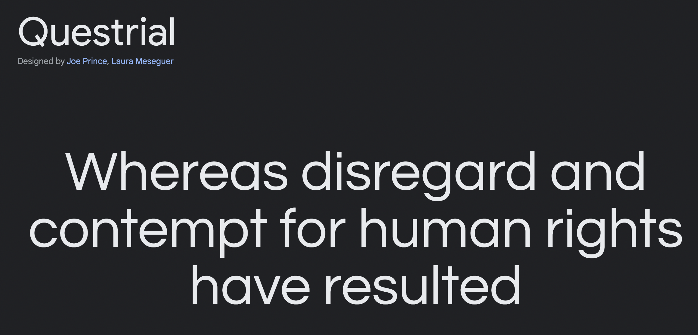

# Milestone Project 1

 

[Link to Live Website](https://tommahawk65.github.io/MS1-resub-/) 

## UX

### User Stories

- As a user visiting the site for the first time:
  - I want to be able to quickly understand the purpose of the site.
  - I want to click the navigation links to be taken to the correct section and also back to home for a better user experience.
  - I want the page to be in a predictable layout so that I can navigate it easily.  
  - I want to be able to hear a selection of the bands music.  
  - I want the websites design to match with the bands.
  - I want to be able to view information on tours and upcoming events.
  - I want to have a way of contacting the site owner/band for any specific questions/queries.
  - I want to have be able to view the page on multiple devices and have it scale properly.

### Project Goals

#### External user’s goal:
The site's users are fans and potential fans who wish to learn more about the band's history and the band members, listen to their music and possibly book them for shows.

#### Site owner's goal:
The band are interested in increasing their fan base and selling more tickets to gigs.

### Design choices
I chose a modern minimalist style to reflect the music of the band and to appeal to a younger audience.

#### Fonts
I did research on the fonts used in the 1975 band promo material. most of the fonts were custom made, however I found googles Questrial font family closely resembled the look of the custom fonts and suited my websites theme well.

#### Questrial font preview
 

#### Colours
The website focuses on a black and white aesthetic. I chose this due to the large amount of material the band produce in this style. I felt the source material would match in with this design well and feel like it works with the bands image.

## Wireframes

### Wireframes Full View

#### Home Page

#### Music Page

#### Tour Dates Page

#### Contact Page

### Wireframes Mobile View

#### Home Page

#### Music Page

#### Tour Dates Page

#### Contact Page

## Features 

### Technologies

#### Programming languages 
- [HTML5](https://developer.mozilla.org/en-US/docs/Web/HTML) - the project used HTML to define structure and layout of the web page. 
- [CSS3](https://developer.mozilla.org/en-US/docs/Web/CSS) - the project used CSS style sheets to specify style of the web document elements; 
 
#### Frameworks & Extensions 
- [Bootstrap v5.2](https://getbootstrap.com/) – Bootstrap is a web framework that focuses on simplifying the development of informative web pages. 

- [Font Awesome](https://fontawesome.com/v4.7.0/) - Font Awesome icons were used for the footer social links for the website. 

#### **Tools**
- [GitHub](https://github.com/) - GitHub is a global company that provides hosting for software development version control using Git. 

- [Gitpod](https://gitpod.io/workspaces/) - One-click ready-to-code development environments for GitHub. 

- [Google fonts](https://fonts.google.com/) - Used to compare and choose fonts. 

- [Figma](https://www.figma.com/) - Figma is used to create the mockup designs for the project.

- [Chrome DevTools](https://developers.google.com/web/tools/chrome-devtools/open) - Used to detect problems and test responsiveness.

- [W3C Markup Validation Service](https://validator.w3.org/) - The W3C Markup Validation Service is used to check whether there were any errors in the HTML5 code. 

- [W3C CSS validator](https://jigsaw.w3.org/css-validator/) - The W3C CSS validator is used to check whether there were any errors in the CSS3 code.

### Existing Features

- __Navigation Bar__

  - Featured on all four pages, the full responsive navigation bar includes links to the Home page, Music, Tour Dates and Contact page and is identical in each page to allow for easy navigation.

  - This section will allow the user to easily navigate from page to page across all devices without having to revert back to the previous page via the ‘back’ button. 

- __The Footer__ 

  - The footer section includes links to the relevant social media sites for the band. The links will open to a new tab to allow easy navigation for the user. 

  - The footer is valuable to the user as it encourages them to keep connected via social media.

- __Home Page__

  - The home page greets new visitors with a collection of band member photos to identify the members.

  - There is also some basic info to give visitors some simple background information.

- __Music__

  - The music page will provide the user with supporting video/audio to see what the bands looks and sounds like. 

  - This section is valuable to the user as they will be able see and hear the bands music videos and full back catalogue.

- __The Tour Dates Page__

  - This page will allow users to see all the tour dates of the band and plan for when they come to their local area.

- __The Contact Page__

  - This page allows users to send a question to band, it also allows the band to receive emails from potential customers for marketing.

## Testing 

### User Stories Testing

- As a user visiting the site for the first time:

  1. I want to be able to quickly understand the purpose of the site.

      On loading the page you are immediately shown the name of the band in the navbar and the band members images.

  2. I want to click the navigation links to be taken to the correct section and also back to home for a better user experience.

      Navbar clearly shows all available paged and allows the user to return to the homepage.
      

  3. I want the page to be in a predictable layout so that I can navigate it easily.

      As shown in other screenshots, the site has a very simple layout that is easy to navigate with a clear navbar layout.

  4. I want to be able to hear a selection of the bands music.  

      The music page contains an embedded video and music player to allow the user to access this while staying to the site.
      

  5. I want the websites design to match with the bands.

      All images and fonts are used by the band in their promo material. I decided to give all my boxes the glow effect that features on their album cover, the black and white aesthetic also matches this.

  6. I want to be able to view information on tours and upcoming events.

      The Tour Page gives all this information, on the commercial version the buy now links would direct the user to the appropriate retailer.
      

  7. I want to have a way of contacting the site owner/band for any specific questions/queries.

      The Contact page allows users to directly message the site owner. The form has validation functionality to ensure the correct information is given. 
      

  8. I want to have be able to view the page on multiple devices and have it scale properly.

      The site has been designed and tested to scale well on all devices. Both Chrome dev tools and manual testing were used to check the performed as intended.

### Manual Testing

- All internal links and buttons checked

- Media checked to ensure it plays when requested

- Chrome devtools used to check on multiple device sizes

- Tested on Chrome and Safari browsers

- Tested on Macbook Pro, Macbook Air, Iphone 13 pro, Ipad, Samsung Note2 to ensure compatibility.

### Lighthouse Testing
Passed tests with a green score. Note - one test did give a yellow score for best practices which is explained below.

#### Desktop

Note - The lower score for best practices here is for the banner image resolution, however on bigger screens I found the quality was degraded when lowered, so for now this has been ignored.

#### Mobile

### Validator Testing 

- HTML
  - No errors were returned when passing through the official [W3C validator]
  
  
  
  
- CSS
  - No errors were found when passing through the official [(Jigsaw) validator]
  

## Bugs
- On some Iphones the background image scaling does not behave as expected and causes it to be larger than normal, from searching online and my own efforts it was unclear why this happened and no apparent solution was clear. As this is not a site breaking bug it I decided to leave it.

## Deployment
The project was developed using [GitPod](https://gitpod.io/) and pushed to [GitHub](https://github.com/):

To deploy the page to **GitHub Pages** these steps were taken:
1. Log in to **GitHub**.
2. Select https://github.com/Tommahawk65.
3. Click Settings and scroll down to **Pages**.
4. Under **Source** select **None** and then **Master Branch**.
5. The site automatically refreshes and the website deployed providing the link: https://tommahawk65.github.io/MS1-resub-/index.html

### How to contribute to the site
1. Navigate to [GitHub](https://github.com/) and log in
2. Locate my [Repository](https://github.com/Tommahawk65/MS1-resub-)
3. On the right side of the screen click Fork
4. This creates a copy in your own repository to make changes in [GitPod](https://gitpod.io/)
5. Once finished with changes add, commit and push to your own [GitHub](https://github.com/)
6. Click Pull Requests and select "New Pull Request" button.

### How to run the project locally
To clone this project from GitHub follow the instructions taken from [GitHub Docs](https://docs.github.com/en/github/creating-cloning-and-archiving-repositories/cloning-a-repository):
1. Navigate to my [GitHub Repository](https://github.com/Tommahawk65/MS1-resub-)
2. Above the files click the green Download Code link.
3. To clone using HTTPS click the clipboard symbol under "Clone with HTTPS". To clone using SSH key click Use SSH then click the clipboard symbol. To clone using GitHub CLI select Use GitHub CLI and click the clipboard symbol. 
4. Open Git Bash
5. Change the working directory to the location you want the cloned directory to be.
6. Type 'git clone' and paste the url copied from step 3. 
7. Press 'enter' to create your clone.

## Credits 
- The text for the Home page was taken from Wikipedia https://en.wikipedia.org/wiki/The_1975
- The icons in the footer were taken from [Font Awesome](https://fontawesome.com/)
- The back text outline feature was taken from stack overflow (see style.css) (https://stackoverflow.com/questions/14310154/how-do-i-set-a-background-color-for-the-width-of-text-not-the-width-of-the-enti)

### Media
- The navbar logo image was taken from (https://i.redd.it/ujaqgg3dya021.jpg)
- The images of the band on  the home page were taken from (https://www.thefader.com/2019/09/12/the-1975-notes-on-a-conditional-form-interview)
- I used Spotify and YouTube to embed the media content (https://vimeo.com/77177308)(https://open.spotify.com/playlist/2XJHmI31uAsaSQTjPqcAPk?si=4860823d6a104d68)
